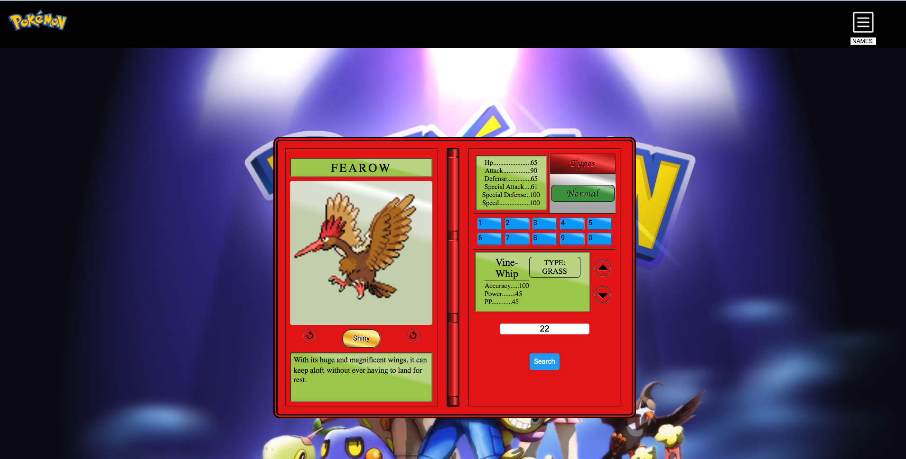

#  POKEDEX JAVASCRIPT/JQUERY/AJAX API PROJECT

This project was built with the javascript library JQuery with AJAX, and the pokemeon API  https://pokeapi.co/ to focus on get requests and working with
data on front end.  The UI was inspired by a React project from Codepen.io. I basically desconstructed the react project and re-created it with JQuery.

**Screenshots**

**Demo**
---------

The project is live on GH Pages -
[Click Here](https://leonredman.github.io/JQuery-Pokedex/)

 **Built With**

* HTML5
* CSS3 
* JQuery
* AJAX

